<h3><code>c0dse@github ~ $ ./activity.sh</code></h3>

  

<h3><code>c0dse@github ~ $ whoami</code></h3>

<table>
  <tr>
    <td valign="top">
      
    </td>
    <td valign="top">
      
    </td>
  </tr>
</table>

 

Java · Spring · Python · PostgreSQL · PostGIS

  

Want to get in touch? Open an issue on one of my repositories.

